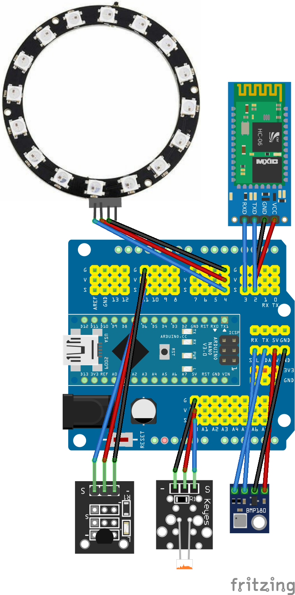
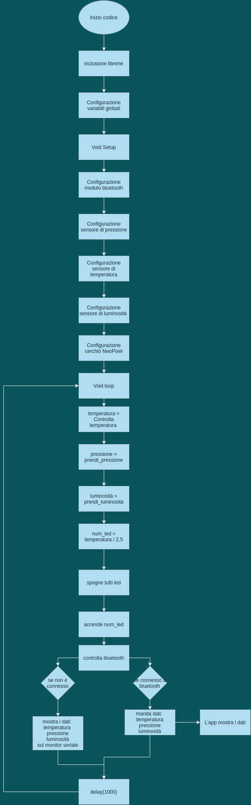

# Stazione metereologica

## Schemi

##### Schema circuito

##### Diagramma di flusso

## Come possiamo utilizzarla

Come possiamo utilizzarla

Grazie a questa stazione meteorologica possiamo osservare nel corso della giornata il cambiamento della luminosità, della temperatura e della pressione.​

Un'interessante impiego per questo progetto potrebbe essere prevedere l'arrivo di un temporale o semplicemente studiare il variare della temperatura e della luminosità in funzione del cambiare delle stagioni: infatti in estate la temperatura si alzerà e la luminosità calerà nelle ore più tarde.

## Sensori

##### Bluetooth

- Tutti i dati raccolti dalla nostra stazione possono essere inviati al nostro cellulare grazie alla connessione tra l'arduino e un'apposita applicazione: REMOTE XY

- Se questo non fosse possibile, cioè quando non può avvenire la connessione tra i due dispositivi, i dati vengono comunque trascritti sul serial monitor

##### Il sensore di luminosità​

Grazie a questo sensore misuriamo l'intensità luminosa, e quindi quando sta per sorgere o quando sta per calare il sole. Inoltre possiamo studiare il mutare della temperatura quando è notte o giorno, leggendo sulla nostra app cosa ci dice l'arduino

##### Temperatura

Nel programma possiamo osservare che la temperatura è uno dei pilastri del progetto, infatti al variare di essa ​ seguono l'aumento o la diminuzione della pressione e il numero di led accesi sul neopixel​

In questo caso quando la temperatura sarà maggiore di ​ 25 °C ci verrà scritto "fa caldo" mentre quando la temperatura sarà minore di 15 °C ci verrà scritto "fa freddo"

##### Pressione

Questo sensore è fondamentale per prevedere l'arrivo di un temporale e, grazie alla nostra stazione, possiamo facilmente scoprire quando la pressione sta calando per avvisare se è necessario prendere l'ombrello o meno.

##### Cerchio led

La parte più interessante di questa stazione è rappresentato dal neopixel.​

Ogni 2,5 °C si illuminerà di verde un led, per fare un semplice esempio: quando il sensore di temperatura indicherà ​ 25 °C, il programma dividerà i gradi per 2,5, la risultante sarà il numero di led accesi, ovvero 10.

## risorse

- [Sensore di pressione BMP180](https://drive.google.com/file/d/185mfIF-Y16Fn6RBizi2MPYvziHR-UzQp/view?usp=sharing)

- [Sensore di luce fotoresistenza](https://drive.google.com/file/d/1tzmUe39h02V5yJXpdAvTZC0qgAgWyvVN/view?usp=sharing)

- [Sensore di temperatura 1 TMP36](https://drive.google.com/file/d/1n9LEQTf4RecP0amwR0Ptwbu3AUpRn24R/view?usp=sharing)

- [Sensore di temperatura 2 sketch](https://docs.google.com/document/d/1Yl5O1vInSW-fhZkOnqtyMntuZBgb_DcgBC3i-YJTFYA/edit?usp=sharing)

- [Neopixel Ring](https://drive.google.com/file/d/1sPSG9f1kq6LIQeR3Zu6kmHN77ojyOwQi/view?usp=sharing)

- [Chip bluetooth HC-06](https://drive.google.com/file/d/1WchmedHfUjAXKJ_Ye_O8XLjfQ2_9cp8W/view?usp=sharing)

- [Tool RemoteXY](https://drive.google.com/file/d/1oHfJn81p7IzbGLxb1Kq10JiJHknpRb9J/view?usp=sharing)
